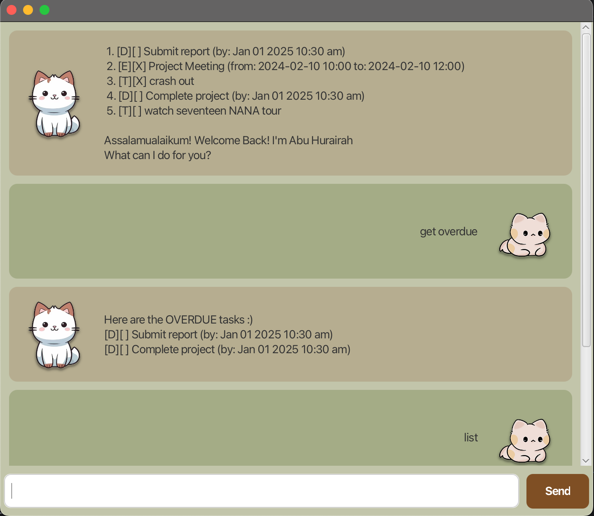

# Abu Hurairah Bot 
> Designed for muggers by muggers

## 🐱 How it looks


## 💅 Description
Abu Hurairah was designed as part of ***NUS CS2103T Course's Individual Project***. (Abu Hurairah means father of the kittens hence the cat theme:)

## 🥵 Features 

- Task Management
- Deadline Retrieval
- Event Scheduling

## 🤠 How to Use

This chatbot can handle various types of tasks and commands, which can be invoked using specific keywords. Below is a guide to the available commands and their functionalities:

### Commands

1. **todo**: Adds a simple to-do task to your list.
   - Example: `todo <task_description>`
    
3. **event**: Adds an event task to your task list.
   - Example: `event <event_description> /from <event_start_time> /to <event_end_time> `
   - Start and end time should be formatted as "YYYY-MM-DD HH:mm" OR "MMM dd yyyy hh:mm a" format

4. **deadline**: Adds a deadline task to your task list.
   - Example: `deadline <task_description> /by <deadline_time>`
  
1. **mark**: Marks a task as completed.
   - Example: `mark <task_number>`

2. **unmark**: Marks a task as not completed.
   - Example: `unmark <task_number>`

6. **list**: Displays all tasks currently in your list.
   - Example: `list`

7. **delete**: Removes a task from your list.
   - Example: `delete <task_number>`

9. **get overdue**: Retrieves all overdue items not marked as completed.
   - Example: `get overdue`

10. **find**: Searches for tasks containing a specific keyword.
    - Example: `find <keyword>`

11. **alias**: Assigns a custom alias to a task for easier reference.
    - Example: `alias <default_command> <alias_name>`

8. **bye**: Exits the chatbot and saves any new information added.
   - Example: `bye`

### Example Usage

```bash
todo Buy groceries
event Meeting with John /from 2024-02-10 10:00 /to 2024-02-10 12:00
deadline Complete project /by Jan 01 2025 10:30 am
mark 2
unmark 1
list
delete 3
get overdue
find groceries
alias todo t
bye
```
